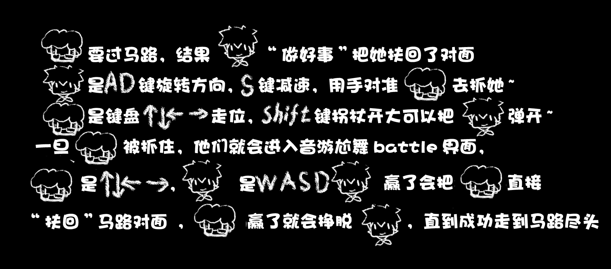

# CGJ2019-我FU了你

策划：熊吉、死海文书

美术：豆包

程序：缪缪缪、液态氧斯基

###  玩法说明

老奶奶要过马路，结果小学生“做好事”把她扶回了对面!

小学生是ad键旋转方向，s键减速，用手对准老奶奶去抓她~

老奶奶是键盘上下左右走位，shift键拐杖开大可以把小学生弹开~

一旦老奶奶被抓住，他们就会进入音游尬舞battle界面， 

老奶奶是上下左右，小学生是wasd~

小学生赢了会把老奶奶直接“扶回”马路对面，

老奶奶赢了就会挣脱小学生，直到成功走到马路尽头

